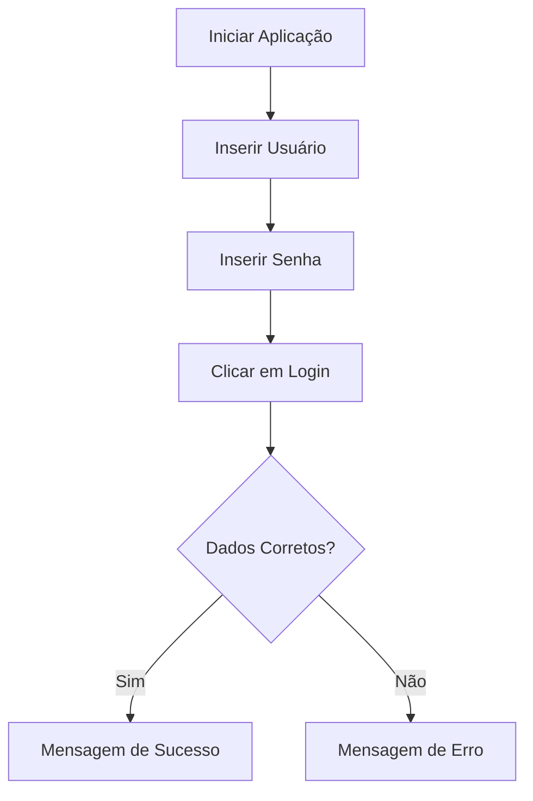

# 🔐 Python Login Interfaces

<div align="center">


Projeto desenvolvido para estudos de interfaces gráficas em Python, implementando sistemas de login utilizando diferentes bibliotecas GUI.

</div>

---

## 📖 Sobre o Projeto

Este repositório reúne duas versões de uma aplicação de login desenvolvidas em Python, cada uma utilizando uma biblioteca gráfica diferente.

O objetivo é comparar abordagens para criação de interfaces desktop, praticando:

- Desenvolvimento de GUIs;
- Manipulação de eventos;
- Validação de dados;
- Organização de código;
- Experiência do usuário.

---

## 📂 Estrutura do Projeto

```text
Interface-python/
│
├── interface.py
├── cadastro.py
├── README.md

```

---

## 🛠️ Tecnologias Utilizadas

| Tecnologia | Finalidade |
|------------|------------|
| Python | Linguagem principal |
| CustomTkinter | Interface moderna baseada em Tkinter |
| PySimpleGUI | Criação simplificada de interfaces gráficas |

---

# 🖥️ Projeto 1 — CustomTkinter

Arquivo:

```text
interface.py
```

### Funcionalidades

✅ Campo de usuário

✅ Campo de senha

✅ Botão de login

✅ Validação de credenciais

✅ Mensagens visuais de sucesso e erro

✅ Interface moderna utilizando CustomTkinter

### Credenciais de Teste

```text
Usuário: felype
Senha: 123456
```

### Fluxo de Funcionamento



---

# 🖥️ Projeto 2 — PySimpleGUI

Arquivo:

```text
cadastro.py
```

### Funcionalidades

✅ Campo de usuário

✅ Campo de senha mascarada

✅ Checkbox para salvar login

✅ Botão de autenticação

✅ Validação de credenciais

✅ Interface simplificada utilizando PySimpleGUI

### Credenciais de Teste

```text
Usuário: felype
Senha: 123456
```

### Resultado Esperado

Quando as credenciais forem válidas:

```text
Bem-vindo ao FelyDev
```

---

## ▶️ Como Executar

### 1. Clone o repositório

```bash
git clone https://github.com/FeeSz/Interface-python.git
```

### 2. Acesse a pasta

```bash
cd Interface-python
```

---

## Executar a versão CustomTkinter

### Instalar dependência

```bash
pip install customtkinter
```

### Executar

```bash
python interface.py
```

---

## Executar a versão PySimpleGUI

### Instalar dependência

```bash
pip install PySimpleGUI
```

### Executar

```bash
python cadastro.py
```

---

## 🎯 Objetivos de Aprendizado

Este projeto foi criado para praticar:

- Programação orientada a eventos;
- Desenvolvimento de interfaces desktop;
- Manipulação de formulários;
- Validação de credenciais;
- Bibliotecas gráficas para Python.

---

## 🚀 Melhorias Futuras

- [ ] Cadastro de usuários
- [ ] Banco de dados SQLite
- [ ] Criptografia de senhas
- [ ] Recuperação de senha
- [ ] Sistema de permissões
- [ ] Tema escuro/claro
- [ ] Persistência de login
- [ ] Dashboard após autenticação

---

## 👨‍💻 Autor

**Felype Souza**

Desenvolvedor em formação e estudante de Desenvolvimento de Sistemas.

🐙 GitHub: https://github.com/FeeSz

---

## 📄 Licença

Projeto desenvolvido para fins educacionais e aprendizado em Python.
